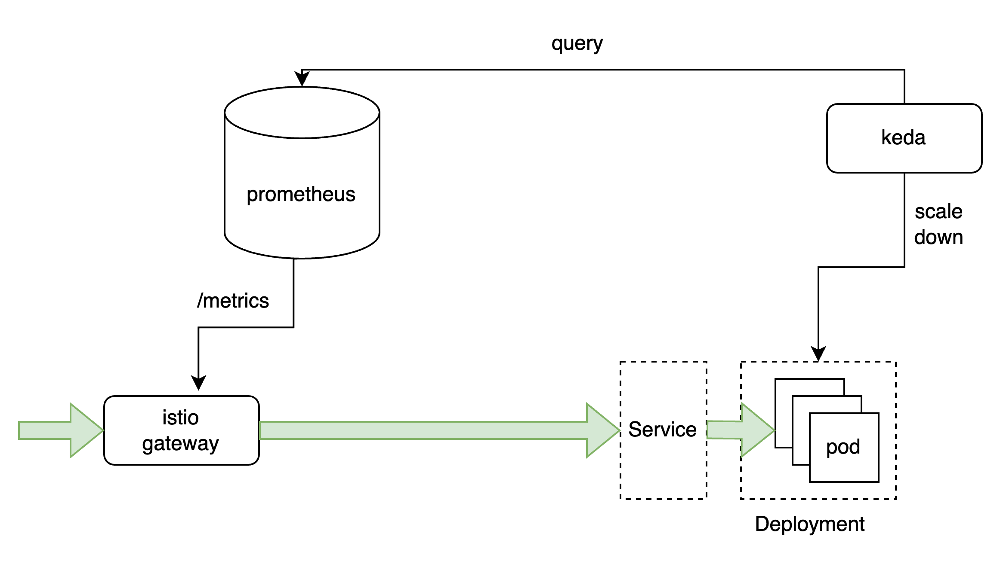

<!-- START doctoc generated TOC please keep comment here to allow auto update -->
<!-- DON'T EDIT THIS SECTION, INSTEAD RE-RUN doctoc TO UPDATE -->
**Table of Contents**  *generated with [DocToc](https://github.com/thlorenz/doctoc)*

- [Integration with HPA](#integration-with-hpa)
- [Integration with KEDA](#integration-with-keda)
  - [Prerequisites](#prerequisites)
  - [Starting setup](#starting-setup)
  - [Add Elasti to the service](#add-elasti-to-the-service)

<!-- END doctoc generated TOC please keep comment here to allow auto update -->

# Integration with HPA
Elasti works seamlessly with Horizontal Pod Autoscaler (HPA) and handles scaling to zero on its own. Since Elasti manages the scale-to-zero functionality, you can configure HPA to handle scaling based on metrics for any number of replicas **greater than zero**, while Elasti takes care of scaling to/from zero.

# Integration with KEDA
Elasti takes care of scaling up a service when there is some traffic. We need another component to scale down the service when there is no traffic. KEDA is a good candidate for this.
Here we will see how to integrate Elasti with KEDA to perform a complete scaling solution.

## Prerequisites
- Istio installed in the cluster - [Istio Installation](https://istio.io/latest/docs/setup/getting-started/)
- KEDA installed in the cluster - [KEDA Installation](https://keda.sh/docs/latest/deploy/)
- Elasti installed in the cluster - [Elasti Installation](https://github.com/truefoundry/elasti)
- Prometheus installed in the cluster - [Prometheus Installation](https://prometheus.io/docs/prometheus/latest/installation/)
- A service to scale

## Starting setup
Let's start with a setup where scaling down to zero is performed by KEDA for a service deployed behind istio.



- traffic is being routed to the service via istio
- keda handles the autoscaling logic for the service from minReplicas to maxReplicas based on it's triggers

The keda scaler yaml for such a setup is as follows:

```yaml
apiVersion: keda.sh/v1alpha1
kind: ScaledObject
metadata:
  name: <service-name>-scaled-object
spec:
  maxReplicaCount: 1
  minReplicaCount: 1
  pollingInterval: 30
  scaleTargetRef:
    apiVersion: apps/v1
    kind: Deployment
    name: <service-name>
  triggers:
    - type: <trigger-type>
      metadata:
        <trigger-metadata>
```

Refer to the [keda documentation](https://keda.sh/docs/2.16/reference/scaledobject-spec/) for more details on configuring the ScaledObject.

## Add Elasti to the service
We will create an [ElastiService](../README.md#1-define-an-elastiservice) object for this service, update the keda scaler to query the Elasti metrics and add a scrapeconfig to the prometheus instance to scrape the Elasti metrics. The final setup will look like this:


Here is the flow of requests:
- first request on istio will go to resolver
- controller will scale up the service to 1 replica
- resolver will forward the request to the pods for further processing

When elasti scales down the service, it will pause the keda ScaledObject to prevent it from scaling up the service again, and when elasti scales up the service, it will resume the ScaledObject.

To achieve this, we will have to add the ScaledObject details to the ElastiService.

Note that the namespace that the ElastiService is created in **must** be the same as the namespace that the keda ScaledObject is deployed in.

An example of the ElastiService object is as follows:

```yaml
apiVersion: elasti.truefoundry.com/v1alpha1
kind: ElastiService
metadata:
  name: <service-name>-elasti-service
spec:
  autoscaler:
    name: <service-name>-scaled-object # Must be the same as the keda ScaledObject name
    type: keda
  cooldownPeriod: 300 # Elasti will not scale down a service for at least cooldownPeriod seconds from lastScaledUpTime
  minTargetReplicas: 1
  scaleTargetRef:
    apiVersion: apps/v1
    kind: Deployment
    name: <service-name>
  service: <service-name>
  triggers:
    - metadata:
        query: sum(rate(istio_requests_total{destination_service="<service-name>.demo.svc.cluster.local"}[1m])) or vector(0)
        serverAddress: http://<prometheus-instance-url>:9090
        threshold: "0.01"
      type: prometheus
 ```

With these changes, elasti can reliably scale up the service when there is traffic and scale down the service to zero when there is no traffic.