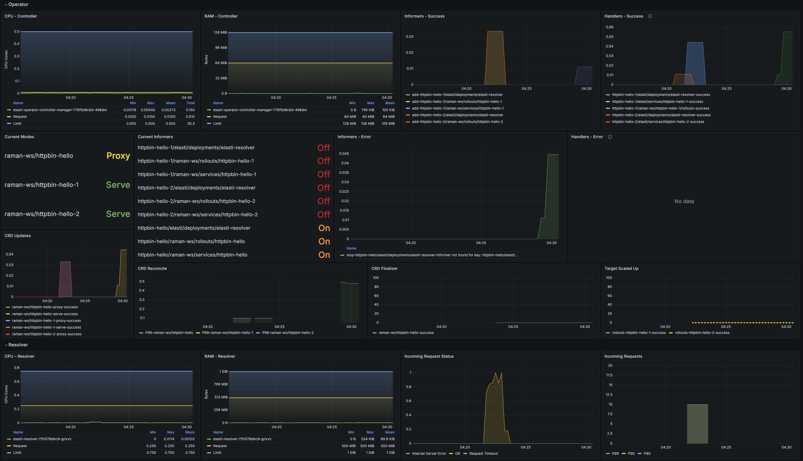

# Monitoring

Set `.global.enableMonitoring` to `true` in the [values.yaml](https://github.com/truefoundry/KubeElasti/blob/main/charts/elasti/values.yaml) file to enable monitoring.

This will create two ServiceMonitor custom resources to enable Prometheus to discover the KubeElasti components. To verify this, you can open your Prometheus interface and search for metrics prefixed with `elasti_`, or navigate to the Targets section to check if KubeElasti is listed.

Once verification is complete, you can use the [provided Grafana dashboard](https://github.com/truefoundry/KubeElasti/blob/main/playground/infra/elasti-dashboard.yaml) to monitor the internal metrics and performance of KubeElasti.

